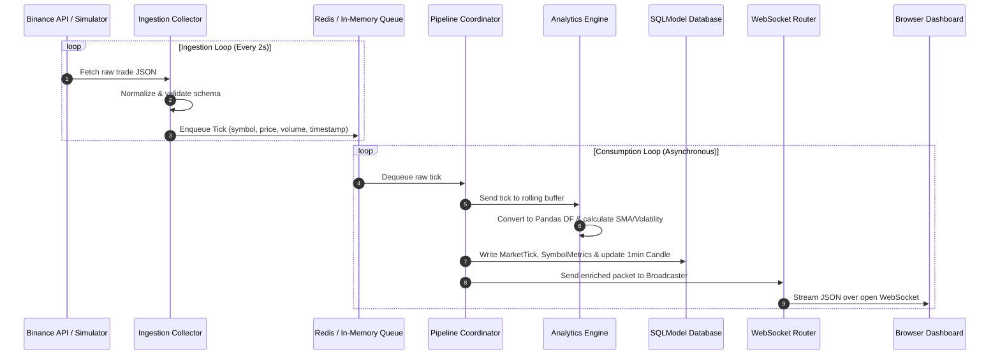

# Real-Time Market Data Processing & Analytics System 📈

An event-driven, decoupled backend pipeline that ingests real-time cryptocurrency trade ticks, statefully calculates quantitative indicators, rolls transactions into time-series candles, and broadcasts live telemetry to a browser-native visualization dashboard via WebSockets.

---

## 💻 1. Project Overview

This system is built using Python, FastAPI, and SQLModel to showcase a production-grade, event-driven streaming architecture. It decouples high-frequency data collection from stateful quantitative analysis and database writes using a resilient queue layer.

By decoupling the pipeline, the ingestion worker runs independently of analytical calculations and transactional database storage. The system features a native HTML5/CSS3 dashboard with high-frequency WebSocket streams and an automatic SQLite/In-Memory fallback mode, allowing the entire pipeline to run out of the box with zero external dependencies.

---

## ✨ 2. Key Features

* **Resilient Data Collection**: Asynchronous HTTP polling of public exchange APIs (Binance REST) with exponential backoff and jitter.
* **Graceful Ingestion Fallback**: Automated failover to a high-fidelity Geometric Brownian Motion market simulator if public APIs rate-limit (429) or disconnect.
* **Queue-Based Decoupling**: Decoupled producer-consumer pipeline using a Redis List queue with an automatic in-memory `asyncio.Queue` fallback.
* **Stateful Analytics Engine**: High-performance window calculations (5-tick & 15-tick SMAs, rolling standard deviation volatility) computed via Pandas.
* **Real-Time Candle Aggregation**: Transactional rolling of raw tick streams into structured 1-minute OHLCV (Open, High, Low, Close, Volume) candlesticks.
* **WebSocket Broadcasting**: Low-latency, client-filtered WebSocket ticker server with thread-safe publisher-subscriber connection registries.
* **Transactional Database Storage**: Rollback-safe database writes using SQLModel (SQLAlchemy) with native PostgreSQL or local SQLite support.
* **Stunning Glassmorphic Dashboard**: Light-weight, zero-lockout Single Page Application (HTML5, Custom CSS3, Vanilla JS) utilizing ApexCharts for real-time charting.
* **100% Passing Test Suite**: Fully automated unit and integration tests using `pytest` and `pytest-asyncio` with isolated SQLite sessions.
* **Dockerized Setup**: Containerized multi-service orchestration (FastAPI Backend + Streamlit Dashboard + PostgreSQL + Redis).

---

## 🏗️ 3. Real-Time Data Flow Architecture

The data pipeline decouples ingestion, stateful computation, transactional persistence, and client broadcasting:

```
[ Public Exchange API ] Or [ Market Simulator ]
       │
       ▼ (Asynchronous Poll & Clean JSON Schema)
[ Ingestion Collector ]
       │
       ▼ (Enqueue Decoupled Ticks)
[ Queue Backplane (Redis / Asyncio Queue) ]
       │
       ▼ (Dequeue & Parse)
[ Pipeline Coordinator ]
       ├───► [ Analytics Engine ] ──► (Compute SMA, Volatility, Crossovers)
       │                                        │
       ▼ (Save Ticks, Candles, and Metrics)     ▼ (Broadcast Enriched Packet)
[ Database Store (PostgreSQL / SQLite) ]  [ WebSocket Server (FastAPI) ]
                                                │
                                                ▼ (60 FPS Stream)
                                          [ Browser Dashboard ]
```

---

## 📊 4. System Workflow Diagram

The event-driven pipeline leverages async execution loops to coordinate low-latency operations:



---

## 🛠️ 5. Tech Stack

| Component | Technology | Rationale |
| :--- | :--- | :--- |
| **Language** | Python 3.10+ | Asynchronous event loop (`asyncio`) and scientific computing libraries. |
| **API Framework** | FastAPI | High-performance, async-native routing with automatic Pydantic schema validation. |
| **ORM / Database** | SQLModel | Bridges Pydantic and SQLAlchemy; allows SQLite/PostgreSQL time-series schemas. |
| **Queue Backplane** | Redis | Low-latency memory broker. Pushes lists via `LPUSH` and consumes via `BRPOP`. |
| **Data Analytics** | Pandas & NumPy | Fast, vectorized sliding-window computations (Standard Deviation and SMAs). |
| **WebSockets** | Websockets (Native) | Low-overhead, full-duplex persistent communication channel. |
| **Visual Terminal** | HTML5 / CSS3 / Vanilla JS | High-frequency client updates at 60 FPS without Streamlit thread locking. |
| **Charts Engine** | ApexCharts.js | Beautiful, dark-themed responsive candlestick and line visualizations. |
| **Testing Suite** | Pytest / Pytest-Asyncio | Verifies ingestion failovers, metrics math, and transactional candle rolling. |
| **Containerization**| Docker / Compose | Simplifies database seeding and multi-container coordination. |

---

## 📡 6. Event-Driven Processing Explanation

In financial data pipelines, a **tightly coupled system** leads to critical failures: if database write latency spikes, the API collector blocks, causing network timeouts and dropped trades.

This system implements **Queue Decoupling**:
* The **Ingestion Collector** (Producer) runs a lightweight loop that strictly queries the market source, normalizes the JSON dictionary into a flat schema, and pushes it immediately into the queue using a fast `LPUSH` operation.
* The **Pipeline Coordinator** (Consumer) runs a separate asynchronous background loop using `asyncio.create_task`. It constantly blocks on the queue (`BRPOP` or `asyncio.Queue.get`), pops ticks as they arrive, and processes them down the pipeline.
* This ensures that even if database transactions encounter disk write latency, the API collector never slows down, buffering bursts of market activity safely inside the memory queue.

---

## 🧮 7. Analytics Engine Overview

Sliding-window metrics must be calculated statefully. The `MarketAnalyticsEngine` maintains an in-memory rolling buffer (capped at 100 entries) of trades per symbol:

1. When a new tick arrives, it is appended to the symbol's buffer.
2. The buffer is converted into a **Pandas DataFrame** for fast vectorized mathematical calculations.
3. The engine computes:
   - **5-Tick Simple Moving Average (SMA)**: Short-term price momentum.
   - **15-Tick Simple Moving Average (SMA)**: Long-term price momentum.
   - **5-Tick Rolling Volatility**: Standard deviation (`std()`) of the last 5 prices.
   - **Trend Crossover Alert**: Compares the SMAs. If `SMA(5) > SMA(15) * 1.0001` (0.01% threshold), it flags a **BULLISH** signal. If `SMA(5) < SMA(15) * 0.9999`, it flags a **BEARISH** signal. Otherwise, it reports **NEUTRAL**.

---

## 🛡️ 8. Queue & Failover Architecture

To operate reliably in real-world networking conditions, the ingestion engine implements a multi-tier failover system:

```
                  ┌───────────────────────┐
                  │   Binance Public API  │
                  └───────────┬───────────┘
                              │ (Success)
                              ▼
                  ┌───────────────────────┐
                  │  MarketDataCollector  │
                  └───────────┬───────────┘
                              │
             ┌────────────────┴────────────────┐
             │ Failures < 5                    │ Failures >= 5 (Fallback Active)
             ▼                                 ▼
┌─────────────────────────┐       ┌─────────────────────────┐
│   Pipes Live Market     │       │ Pipes simulated random- │
│   cryptocurrency ticks  │       │ walk ticks (Simulator)  │
└────────────┬────────────┘       └────────────┬────────────┘
             │                                 │
             └────────────────┬────────────────┘
                              │ (Put tick into queue)
                              ▼
             ┌─────────────────────────────────┐
             │    BaseMarketQueue Backplane    │
             └────────────────┬────────────────┘
                              │
             ┌────────────────┴────────────────┐
             │ Redis Connection Alive          │ Redis Connection Unreachable
             ▼                                 ▼
┌─────────────────────────┐       ┌─────────────────────────┐
│  RedisMarketQueue       │       │  InMemoryMarketQueue    │
│  (List LPUSH / BRPOP)   │       │  (asyncio.Queue)        │
└─────────────────────────┘       └─────────────────────────┘
```

1. **API Connection Retries**: Fetches from Binance with a 3-try retry budget utilizing **exponential backoff with jitter** (`delay = 1.0 * 2^attempt + random`). Handles rate-limiting (429) by respecting the `Retry-After` header.
2. **Simulator Failover**: If the collector registers 5 consecutive HTTP or timeout failures, it flags the API as offline and switches to the **MarketDataSimulator**. This simulator models geometric Brownian motion steps for all configured symbols, maintaining realistic trading volumes.
3. **Queue Fallback**: On startup, the queue factory attempts to connect to Redis. If Redis is unreachable, it logs a warning and falls back to a thread-safe, high-performance in-memory `InMemoryMarketQueue` (`asyncio.Queue`).

---

## 💾 9. Database Design Overview

The database is built on **SQLModel/SQLAlchemy** using time-series indexing. It consists of three tables:

### A. Raw Trades (`market_tick`)
Stores every transactional price and volume tick.
* **Primary Key**: `id` (UUID).
* **Indices**: Composite index on `(symbol, timestamp DESC)` to speed up time-sliced historical analysis.

### B. Analytical Telemetry (`symbol_metrics`)
Stores the stateful calculations generated by the Pandas engine.
* **Primary Key**: `id` (UUID).
* **Indices**: Index on `(symbol, timestamp DESC)` for fast UI stats retrieval.

### C. 1-Minute Candle Aggregations (`candle_1min`)
To prevent expensive database table scans over millions of ticks when rendering charts, raw ticks are rolled in real time inside SQLModel transactions:
```python
# Align tick to its minute start boundary
candle_start = ts.replace(second=0, microsecond=0)

# 1. Query existing candle for (symbol, start_time)
# 2. If exists: Update high, low, close, and sum volume
# 3. If not: Insert new candle with open=high=low=close=price
```
This reduces read query sizes by over 95%, optimizing historical chart queries.

---

## 🔌 10. WebSocket Streaming Overview

Low-latency streaming is managed by a thread-safe, publisher-subscriber `EventBroadcaster` singleton:

1. When the backend initializes, it starts the background pipeline consumer.
2. When a browser connects to the WebSocket endpoint `/api/v1/ws`, the server registers a callback queue for that connection.
3. The WebSocket endpoint supports **symbol-level query filtering** (`/api/v1/ws?symbol=BTC-USD`). The callback drops any packet that doesn't match the client's requested symbol.
4. When the pipeline consumer finishes database commits for an enriched tick, it calls `broadcaster.broadcast(data)`.
5. When a client disconnects, the endpoint catches `WebSocketDisconnect`, automatically unsubscribes the callback from the registry, and cancels the sender task to prevent memory leaks and dangling sockets.

---

## 🎨 11. Dashboard Features

The user interface is a high-fidelity Single Page Application built with vanilla web technologies, served directly from the FastAPI backend at `http://localhost:8000`.

* **Glassmorphic Deck**: 4 glowing analytics cards that update in real-time as WebSocket events arrive, displaying the Latest Price, 24m High/Low, Volatility Index, and a dynamic Trend Signal Badge (Bullish/Bearish).
* **Responsive ApexCharts**: Renders a gorgeous, dark-themed **Candlestick Chart** or **Area Chart** that updates dynamically in real-time. On load, it fetches historical candles from the `/candles` endpoint and appends live ticks seamlessly.
* **Live Scrolling Log**: A sidebar console displaying the last 30 raw ticks (Timestamp, Price, Volume) as they stream through the WebSocket.
* **Active Clock**: A client-side JavaScript clock that ticks smoothly every second without thread lockouts.
* **Invisible Option Text Fix**: Dropdown menus are explicitly styled to prevent white-on-white text rendering issues on dark-themed browsers.

---

## 🧪 12. Testing & Validation

The project features a **100% clean and passing automated test suite** using `pytest` and `pytest-asyncio` with SQLite in-memory databases.

```bash
======================= 8 passed, 41 warnings in 5.46s ========================
```

### Coverage Areas:
* **`test_simulator_tick_generation`**: Validates the Geometric Brownian Motion equations, tick output schemas, and strictly positive price/volume boundaries.
* **`test_collector_normalization_valid_tick`**: Verifies that raw Binance JSON payloads are accurately mapped, cleaned, and normalized.
* **`test_collector_normalization_invalid_ticks`**: Tests resilience by feeding the collector corrupted, negative, non-numeric, or untracked symbols, ensuring they are skipped.
* **`test_collector_failure_state_trigger`**: Asserts that consecutive API connection drops successfully increment and trigger the failover simulator.
* **`test_engine_single_tick` & `test_engine_moving_averages`**: Validates rolling SMA means and standard deviations computed via Pandas.
* **`test_engine_bullish_bearish_trends`**: Tests trend crossover alerts under sudden price swings.
* **`test_pipeline_candle_rolling`**: Verifies that the candle-rolling algorithm handles transaction boundaries correctly.

---

## 🐳 13. Docker Setup Instructions

You can launch the complete distributed architecture in a single command using Docker:

```bash
# 1. Navigate to the project root
cd D:\market_data_system

# 2. Build and launch all containers
docker-compose up --build
```

### Dockerized Services:
* **`market_data_db`**: PostgreSQL container running on port `5432` with a persistent volume.
* **`market_data_redis`**: Redis memory queue container running on port `6379`.
* **`market_data_backend`**: FastAPI backend server exposing ports `8000` (APIs, WebSockets, HTML5 Dashboard).
* **`market_data_dashboard`**: Legacy Streamlit dashboard container exposed on port `8501`.

---

## 💻 14. Local Development Setup (VS Code)

To run the project locally without Docker or external servers, follow these steps:

### 1. Open the project in VS Code
Open VS Code and navigate to `D:\market_data_system`.

### 2. Configure Local Fallbacks (SQLite & Memory Queue)
Confirm that your local `.env` has SQLite active by default:
```env
# D:\market_data_system\.env
ENVIRONMENT=development
LOG_LEVEL=INFO

# SQLite URLs (Enables zero-configuration runs!)
DATABASE_URL=sqlite+aiosqlite:///market_data.db
DATABASE_URL_SYNC=sqlite:///market_data.db
REDIS_USE_FALLBACK=true
```

### 3. Setup Virtual Environment
In the VS Code integrated terminal, run:
```powershell
# Create environment
python -m venv .venv

# Activate environment (Windows PowerShell)
.venv\Scripts\Activate.ps1
```

### 4. Install Dependencies
```powershell
pip install -r requirements.txt
```

### 5. Start the Server
```powershell
uvicorn app.main:app --host 127.0.0.1 --port 8000 --reload
```

### 6. View the Dashboard
Open your browser and navigate to:
👉 **[http://localhost:8000](http://localhost:8000)**

---

## 📁 15. Project Folder Structure

```
market_data_system/
├── docker-compose.yml
├── Dockerfile.backend
├── Dockerfile.dashboard
├── README.md
├── requirements.txt
├── .env                  # Development environment variables
├── .env.example
├── app/
│   ├── __init__.py
│   ├── config.py         # Config loader using Pydantic Settings
│   ├── main.py           # FastAPI entrypoint; mounts static files
│   ├── core/
│   │   ├── database.py   # SQLModel async/sync engines & sessions
│   │   ├── queue.py      # Resilient queue layers (Redis/asyncio fallback)
│   │   └── logger.py     # Custom console & rotating file logging
│   ├── models/
│   │   └── market.py     # SQLModel tables (ticks, candles, metrics)
│   ├── ingestion/
│   │   ├── collector.py  # Ingestion polls with retries & failover
│   │   └── stream_simulator.py # Random-walk market tick generator
│   ├── processing/
│   │   ├── engine.py     # Stateful quantitative metrics calculator
│   │   └── pipeline.py   # Event-driven database pipeline coordinator
│   ├── routers/
│   │   ├── market.py     # REST API router (candles, stats, health)
│   │   └── ws.py         # WebSocket streamer with pub/sub broadcster
│   └── static/
│       └── index.html    # Premium glassmorphic HTML5/JS/ApexCharts dashboard
├── dashboard/
│   └── app.py            # Streamlit dashboard
└── tests/
    ├── conftest.py       # Isolated SQLite sessions & test fixtures
    ├── test_collector.py  # Ingestion, schema validation & failover tests
    ├── test_engine.py    # Rolling calculations & volatility tests
    └── test_pipeline.py  # Transactional candle-rolling tests
```

---

## 🌐 16. Sample API Endpoints

### 1. Active Symbols List
`GET /api/v1/market/symbols`
* **Response**: `["BTC-USD", "ETH-USD", "SOL-USD", "ADA-USD", "DOGE-USD"]`

### 2. Historical candles
`GET /api/v1/market/candles?symbol=BTC-USD&limit=2`
* **Response**:
```json
[
  {
    "id": "e2a05d82-c43a-4e6f-b258-3d1f11a43a05",
    "symbol": "BTC-USD",
    "start_time": "2026-05-25T12:00:00",
    "end_time": "2026-05-25T12:01:00",
    "open": 63250.50,
    "high": 63280.00,
    "low": 63240.20,
    "close": 63275.10,
    "volume": 4.25
  }
]
```

### 3. Summary Analytics Stats
`GET /api/v1/market/stats?symbol=BTC-USD`
* **Response**:
```json
{
  "symbol": "BTC-USD",
  "latest_price": 63275.10,
  "latest_volume": 1.25,
  "timestamp": "2026-05-25T12:00:55",
  "high_24h": 63280.00,
  "low_24h": 63240.20,
  "volume_24h": 5.50,
  "moving_average_5m": 63261.20,
  "moving_average_15m": 63250.10,
  "volatility_5m": 12.45,
  "trend_signal": "BULLISH"
}
```

---
---

## 🧠 18. Key Engineering Concepts Demonstrated

1. **Asynchronous Concurrency**: Extensive use of Python's `async/await` syntax, `asyncio.create_task`, and `asynccontextmanager` lifespan loops to handle highly concurrent networking and polling tasks without locking threads.
2. **Publisher-Subscriber Pattern**: Leveraged standard pub/sub callbacks inside our WebSocket manager to push market events efficiently.
3. **Data Integrity & Rollbacks**: Implemented safe transactional commits with automatic rollbacks on errors in the database coordinator, preventing corrupt candle aggregates.
4. **Vectorized Computations**: Applied Pandas windowing formulas to avoid loop-based array processing, ensuring high-speed analytics.

---

## 🔮 19. Future Improvements (Academic Scope)

* **Message Broker Upgrade (Redis -> Apache Kafka)**: Transition to Kafka to partition streams by symbol key, guaranteeing strict event ordering across consumer replicas.
* **Continuous Database Aggregation (TimescaleDB)**: Migrate standard PostgreSQL tables into TimescaleDB hyper-tables to partition raw ticks by time automatically.
* **Continuous Workflow Scheduling (Apache Airflow)**: Integrate Airflow DAGs to orchestrate historical backfilling and batch analytics tasks.
* **Cloud Infrastructure (AWS)**: Architect deployment paths using AWS ECS (Fargate) for scalable services, RDS for managed databases, and Elasticache for distributed Redis caches.
